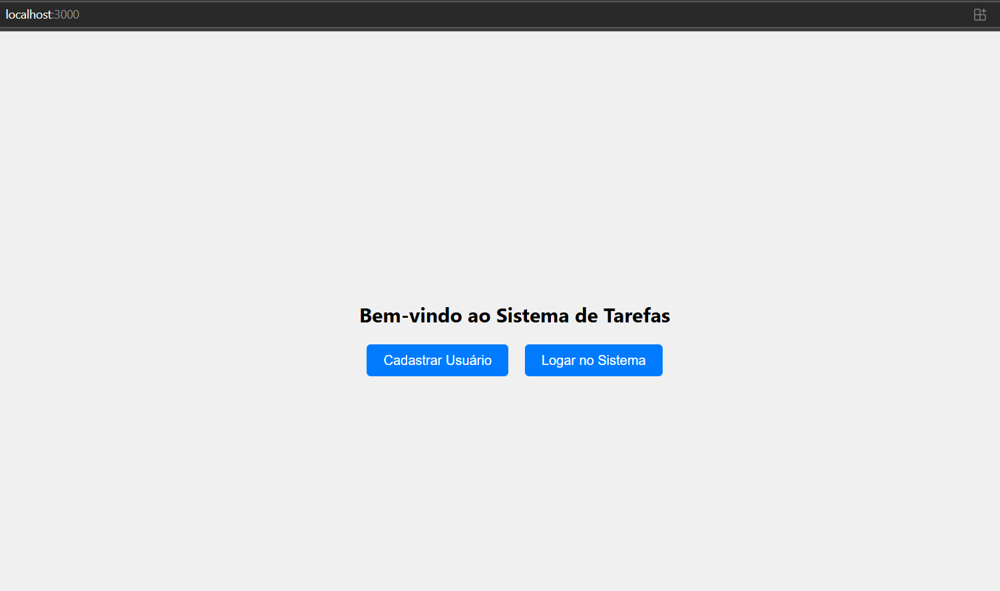
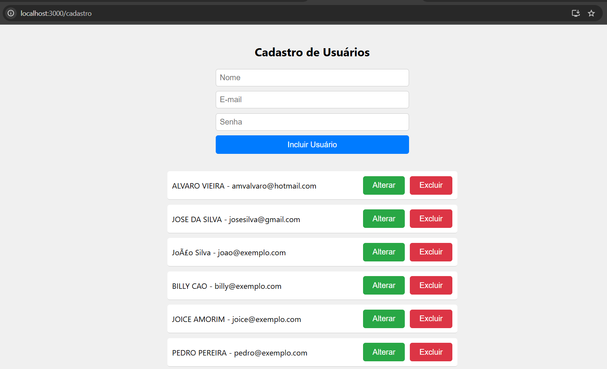
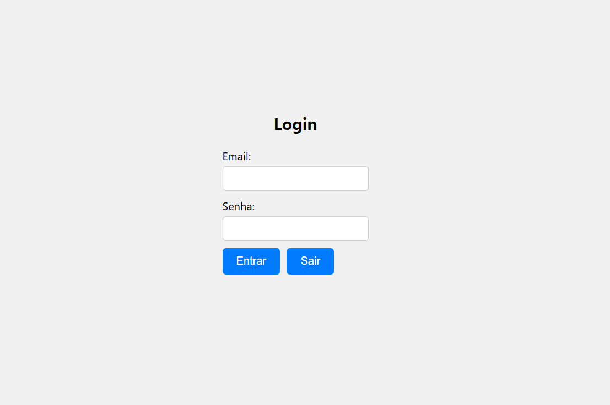
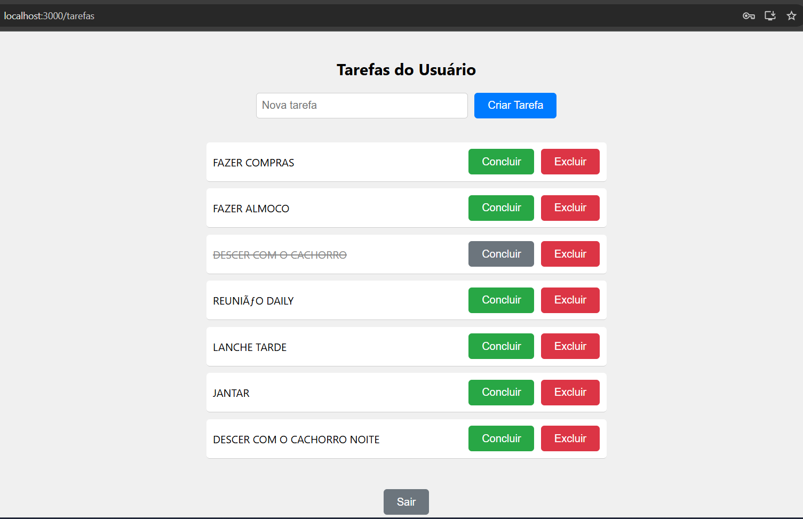

# Web API para controle de tarefas 

## Desafio técnico - Pharmapele - Parte II

## Menu

- [Introdução](#introdução)
  
- [Configurações Iniciais](#configurações)

- [Arquitetura](#arquitetura)

- [Padrões Aplicados](#padrões)

- [Boas Práticas](#boas)

- [Dicas de Uso](#dicas)

## Introdução

Este projeto foi desenvolvido como parte do processo seletivo para a vaga de Programador Delphi na Pharmapele. O desafio consistiu na criação de uma **API RESTful** desenvolvida em Delphi para gerenciar usuários e tarefas, integrada a um **front-end** desenvolvido em **React.js**. O sistema permite a autenticação de usuários, cadastro, login, e o gerenciamento de tarefas (criação, visualização, conclusão e exclusão). O banco de dados utilizado foi o **SQLite**, e o front-end foi construído com componentes reutilizáveis e hooks do React.

O projeto foi desenvolvido seguindo boas práticas de programação, como **Clean Code**, **Clean Architecture**, e princípios de **Orientação a Objetos**. A estrutura do código foi organizada em camadas bem definidas, garantindo modularidade, testabilidade e facilidade de manutenção.

## Configurações

Além do Delphi caso deseje ver os codigos fontes do projeto, deverá ter o horse, o react e o SQLite ao banco de dados da aplicação. Junto com o projeto está sendo enviado o banco de dados (bancoteste.db) que deve ficar junto com servidor da aplicação (APIToDoList.exe) também enviado no projeto. Para acessar as pagina web principal do projeto, digitar no seu navagador localhost:3000. 
O servidor de aplicação do react deve estar rodando, bem com a api do projeto.
Para logar no sistema, usar o email amvalvaro@hotmail.com com a senha 123456.

# Arquitetura

O projeto foi estruturado seguindo os princípios da **Clean Architecture**, com a separação clara das responsabilidades em camadas:

### Estrutura de Pastas

APIToDoList/

    |   application/
    |       tarefa.service.pas
    |       usuario.service.pas
    |  configuration/
    |       database.config.pas
    |   domain/
    |       itarefa.repository.pas
    |       iusuario.repository.pas
    |       tarefa.dto.pas
    |       tarefa.pas
    |       usuario.dto.pas
    |       usuario.pas
    |   frontend-tarefas/
    |       node_modules/
    |          src/
    |             components/
    |                cadastrousuario.js
    |                login.js
    |                mainpage.js
    |                tarefa.js
    |            app.cs
    |            app.js
    |            app.test.js
    |            index.css
    |   infrastructure/
    |      tarefa.repository.pas
    |      usuario.repository.pas
    |   presentation/
    |      usuario.controller.pas
    |      tarefa.controller.pas
    |   session/
    |       UsuarioSession.pas

### Camadas da Aplicação

1. **Domain**:
   - Contém as entidades do domínio (`usuario.pas`, `tarefa.pas`) e as interfaces dos repositórios (`itarefa.repository.pas`, `iusuario.repository.pas`).
   - Define os contratos que o domínio espera para acessar os dados, garantindo que a lógica de negócio não dependa de implementações específicas.

2. **Application**:
   - Contém os serviços (`usuario.service.pas`, `tarefa.service.pas`), que implementam a lógica de negócio.
   - Os serviços dependem das interfaces dos repositórios, seguindo o princípio da **Inversão de Dependência (DIP)**.

3. **Infrastructure**:
   - Contém as implementações concretas dos repositórios (`usuario.repository.pas`, `tarefa.repository.pas`), que lidam com a persistência de dados no banco SQLite.
   - Centraliza a lógica de acesso ao banco de dados, seguindo o princípio da **Separação de Responsabilidades**.

4. **Presentation**:
   - Contém os controladores (`usuario.controller.pas`, `tarefa.controller.pas`), que processam as requisições HTTP e retornam as respostas adequadas.
   - Os controladores dependem dos serviços para executar a lógica de negócio.

5. **Configuration**:
   - Contém a configuração do banco de dados (`database.config.pas`), responsável por criar e gerenciar conexões com o SQLite.

6. **Session**:
   - Contém a lógica relacionada à sessão do usuário (`UsuarioSession.pas`), utilizada para autenticação e gerenciamento de sessões.

7. **Front-end**:
   - Desenvolvido em **React.js**, utilizando **Hooks** (`useState`, `useEffect`) para gerenciar o estado e os efeitos colaterais.
   - Componentes reutilizáveis foram criados para garantir a modularidade e a manutenção do código.

### Reutilização de Código:

As interfaces genéricas (itarefa.repository.pas e iusuario.repository.pas) permitem que as classes que as implementam sigam um padrão comum, promovendo a reutilização de código.

### Facilidade de Testes:

A separação entre a lógica de negócios e o acesso aos dados facilita a criação de testes unitários e a simulação de cenários.

### Legibilidade e Organização:

A estrutura modular e bem organizada torna o código mais legível e fácil de entender, especialmente para novos desenvolvedores que entram no projeto.

## Padrões Aplicados

### Princípios e Padrões Utilizados

1. **Clean Code**:
   - Nomes significativos para variáveis, funções e classes.
   - Funções pequenas e com responsabilidades únicas.
   - Código comentado para facilitar a compreensão.

2. **Clean Architecture**:
   - Separação clara das camadas (Domain, Application, Infrastructure, Presentation).
   - Uso de interfaces para desacoplar a lógica de negócio das implementações concretas.

3. **SOLID**:
   - **Single Responsibility Principle (SRP)**: Cada classe tem uma única responsabilidade.
   - **Open/Closed Principle (OCP)**: As classes estão abertas para extensão, mas fechadas para modificação.
   - **Liskov Substitution Principle (LSP)**: As interfaces garantem que as implementações possam ser substituídas sem afetar o comportamento do sistema.
   - **Interface Segregation Principle (ISP)**: Interfaces específicas para cada necessidade.
   - **Dependency Inversion Principle (DIP)**: Dependências são injetadas via construtor, garantindo flexibilidade e testabilidade.

4. **DTOs (Data Transfer Objects)**:
   - Uso de DTOs para transferência de dados entre as camadas, evitando expor detalhes internos das entidades.

5. **Injeção de Dependência**:
   - As dependências (repositórios) são injetadas nos serviços via construtor, seguindo o princípio da Inversão de Dependência.

6. **Design Patterns**:
   - O projeto implementa diversos padrões de design que reforçam a flexibilidade e a organização do código:

    **Singleton**: Utilizado para a classe TDatabaseConfig, garantindo uma única instância de conexão com o banco de dados, reduzindo a sobrecarga de recursos.
    **Repository**: Responsável pelas operações de persistência no banco de dados, como demonstrado na classe usuario.repository e tarefa.repository.
    **Service**: Centraliza a lógica de negócios mais complexa, como na classe pedido.service, que encapsula operações que não estão diretamente ligadas à camada de apresentação.

## Boas Práticas

1. **Separação de Responsabilidades**:
   - Cada camada do sistema tem uma responsabilidade bem definida, facilitando a manutenção e a evolução do código.

2. **Tratamento de Exceções**:
   - Exceções são tratadas nos controladores, garantindo que erros sejam capturados e retornados de forma adequada ao cliente.

3. **Validação de Dados**:
   - Validações foram adicionadas nos métodos de criação e atualização de tarefas e usuários, evitando problemas com dados inválidos.

4. **Logging**:
   - Logs foram adicionados para registrar eventos importantes, como erros ou operações críticas, facilitando a depuração em produção.

5. **Segurança**:
   - As senhas são armazenadas em texto plano no momento, mas a estrutura do sistema permite a fácil implementação de algoritmos de hash como **bcrypt** para maior segurança.
   - A autenticação pode ser aprimorada com o uso de **JWT (JSON Web Tokens)**.

6. **Testes Unitários**:
   - A estrutura do sistema facilita a implementação de testes unitários, especialmente na lógica de negócio e na interação com o banco de dados.

## Tecnologias Utilizadas

### Back-end (Delphi)
- **Horse**: Framework para criação de APIs RESTful.
- **FireDAC**: Biblioteca para acesso ao banco de dados SQLite.
- **SQLite**: Banco de dados embarcado para armazenamento de dados.

### Front-end (React.js)
- **React Hooks**: `useState` e `useEffect` para gerenciamento de estado e efeitos colaterais.
- **React Router**: Para navegação entre páginas.
- **Fetch API**: Para consumo da API RESTful.

## Dicas de Uso

Ao informar o endereço **localhost:3000, será exibida a tela inicial do sistema

Caso não seja usuario cadastrado, clique no botão *Cadastrar Usuário* para fazer o cadastro de um novo usuário.

Será exibido os campos para inclusão de um novo usuário e uma lista com todos os usuarios cadastrados.

Informe os dados do novo usuário e clique no botão **Incluir Usuário** para incluir o usuário no banco de dados. Caso deseje fazer alguma alteração, clique no usuário desejado e os dados do 
usuário serão preenchidos nos campos relacionados, podendo ser alterados e após a alteração, clicar no botão **Salvar Alteração** para validar as alterações.
Caso deseje excluir um usuário, clicar no botão **Excluir** na linha desejada.

Caso seja um usuário cadastrado, na tela principal, clicar no botão Logar no sistema, para que seja feito o login do usuario. Informe o e-mail e a senha para que seja feita a validação do
usuário. 

Após validação do usuário, será exibida uma lista com todas as tarefas do usuário, conforme mostrado abaixo:

A partir desse momento, pode-se criar novas tarefas preenchendo a tarefa no campo *nova tarefa* e clicando no botão **Criar Tarefa** para gravar a tarefa. Após isso a tarefa fica desabilitada, 
só permitindo excluir a mesma, não podendo mais ser alterada, ou caso o usuário deseje, poderá excluir a tarefa, estando a mesma em aberto ou concluída.